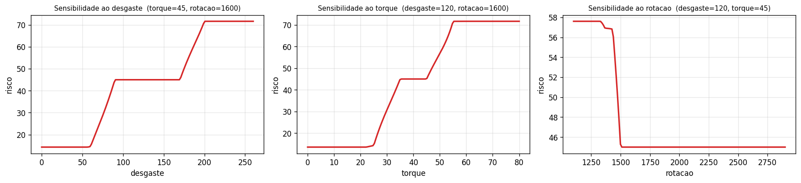

# Sistema de Controle Fuzzy para Manutencao Preditiva Industrial
## Trabalho de Pesquisa e Desenvolvimento — Parte 1 (Sistemas de Controle Fuzzy)

**Disciplina:** Inteligencia Artificial e Computacional (0700M8) — CESUPA, 2026/01
**Modalidade:** Opcao B (produto) · Motor de inferencia: **Mamdani**
**Turma:** _(preencher)_ · **Integrantes:** _(preencher)_
**Repositorio:** _(link GitHub)_

---

## Resumo

Este trabalho apresenta um sistema de controle fuzzy do tipo **Mamdani** que estima
o **risco de falha / urgencia de manutencao** de uma maquina industrial a partir de
tres grandezas de operacao: desgaste da ferramenta, torque e rotacao. O sistema e
modelado sobre o dataset publico **AI4I 2020 Predictive Maintenance** (UCI) e
entregue como um **produto** (interface de linha de comando e notebook interativo).
A saida continua (indice 0-100) e validada contra os rotulos reais de falha,
atingindo F1 de 0,35 num problema fortemente desbalanceado (3,4% de falhas) — um
baseline interpretavel que a Parte 2 do trabalho otimiza automaticamente.

## 1. Introducao e motivacao

Decidir **quando intervir** em uma maquina e uma tarefa carregada de imprecisao e
gradacao. Termos como desgaste "alto", torque "elevado" ou rotacao "baixa" nao tem
fronteiras nitidas, e o operador raciocina de forma linguistica e aproximada. Esse
e exatamente o tipo de problema para o qual a **logica fuzzy** e adequada: ela
representa transicoes suaves entre estados e combina conhecimento do dominio em uma
base de regras legivel.

A escolha do problema atende aos criterios da atividade: e realista, delimitado e
adequado a logica fuzzy; **nao** e um exemplo de sala (gorjeta, ventilador,
irrigacao simples). Ancoramos as variaveis em um dataset real e nos **modos de
falha fisicos** documentados da maquina.

## 2. Fundamentacao teorica

Um sistema fuzzy Mamdani opera em quatro etapas: (i) **fuzzificacao**, que converte
entradas numericas em graus de pertinencia a termos linguisticos; (ii) **inferencia**,
que aplica a base de regras usando operadores fuzzy; (iii) **agregacao** das saidas
das regras; e (iv) **defuzzificacao**, que converte o conjunto fuzzy resultante em um
numero. Adotamos os operadores classicos: conjuncao por **minimo** (AND = min),
implicacao por **minimo** (corte do consequente), agregacao por **maximo** e
defuzzificacao pelo **centroide** (centro de gravidade).

## 3. Analise do problema e dados

O dataset **AI4I 2020** registra 10.000 ciclos de operacao com as variaveis de
processo e um rotulo binario `Machine failure`, alem dos modos de falha:
**TWF** (desgaste da ferramenta), **HDF** (dissipacao de calor), **PWF** (potencia),
**OSF** (sobre-esforco) e **RNF** (aleatorio). A taxa de falhas e de **3,39%**
(339/10000), o que torna a **acuracia** uma metrica enganosa — por isso a validacao
usa **F1 da classe falha** e o **J de Youden**.

As tres entradas escolhidas capturam diretamente os principais modos mecanicos:
- **OSF** depende de desgaste x torque;
- **PWF** depende da potencia (~ torque x rotacao);
- **TWF** depende do desgaste; **HDF** e favorecido por rotacao baixa.

## 4. Modelagem fuzzy

### 4.1 Variaveis e universos de discurso

Os universos e parametros foram **ancorados nos quantis reais** do dataset (desgaste
q95 ~ 206 min; torque q95 ~ 56 Nm; rotacao q95 ~ 1868 rpm) e nos limiares fisicos
dos modos de falha.

| Variavel | Papel | Universo | Unidade | Termos |
|---|---|---|---|---|
| Desgaste | entrada | 0-260 | min | Novo / Moderado / Desgastado |
| Torque | entrada | 0-80 | Nm | Baixo / Normal / Alto |
| Rotacao | entrada | 1100-2900 | rpm | Baixa / Media / Alta |
| Risco | **saida** | 0-100 | indice | Baixa / Moderada / Alta / Critica |

A variavel de entrada principal (desgaste) e a saida possuem, respectivamente, 3 e
4 termos linguisticos, atendendo ao minimo exigido.

### 4.2 Funcoes de pertinencia

Utilizamos MFs **triangulares** e **trapezoidais** (faceis de parametrizar e de
otimizar na Parte 2). Os trapezios das pontas saturam no limite do universo. A
tabela completa de parametros esta em `docs/base_de_regras.md`.


As funcoes tem sobreposicao deliberada (nem estreitas demais, eliminando o carater
fuzzy, nem largas demais, tornando o sistema indiferente).

### 4.3 Base de regras

A base possui **20 regras** (minimo exigido = 12), cada uma justificada por um modo
de falha e cobrindo casos tipicos, intermediarios, criticos e conflitantes. Exemplos:

- *SE desgaste e Desgastado E torque e Alto ENTAO risco e Critica* (OSF severo);
- *SE torque e Baixo E rotacao e Baixa ENTAO risco e Alta* (PWF por baixa potencia);
- *SE desgaste e Novo E torque e Alto E rotacao e Alta ENTAO risco e Moderada*
  (caso conflitante: alta potencia, mas ferramenta nova).

A tabela completa esta em `docs/base_de_regras.md`.

## 5. Implementacao

O motor de inferencia (`src/fuzzy/engine.py`) e **proprio** e **vetorizado** em
NumPy: avalia as 10.000 amostras simultaneamente, o que e essencial para a
otimizacao evolutiva da Parte 2 (milhares de avaliacoes). O sistema e construido em
`src/fuzzy/system.py` e a base de regras em `src/fuzzy/rules.py`. O **produto** e
exposto via CLI (`src/cli.py`), que alem do indice de risco retorna a **explicacao**
da decisao (pertinencias ativas e regras mais disparadas):

```
$ python -m src.cli --desgaste 230 --torque 70 --rotacao 1500 --explain
Indice de risco :  92.7 / 100
Nivel           : CRITICA
Regras mais ativadas:
  [1.00] SE desgaste=Desgastado e torque=Alto ENTAO risco=Critica
```

## 6. Experimentos e validacao

### 6.1 Cenarios de teste

Seis cenarios cobrindo a faixa de operacao:

| Cenario | desgaste | torque | rotacao | risco | nivel |
|---|---|---|---|---|---|
| Baixo (nominal) | 15 | 38 | 1500 | 13,8 | Baixa |
| Medio (envelhecimento) | 120 | 42 | 1600 | ~45 | Moderada |
| Alto/Critico (OSF) | 235 | 70 | 1500 | 92,7 | Critica |
| Fronteirico | 170 | 45 | 1500 | ~58 | Moderada/Alta |
| Conflitante | 10 | 75 | 2600 | ~45 | Moderada |
| Critico (PWF baixa pot.) | 60 | 10 | 1200 | ~57 | Moderada/Alta |

Os valores reproduzem-se executando o notebook 01.

### 6.2 Superficies de controle

As superficies revelam o comportamento global do sistema e confirmam a fisica: a
regiao de OSF (desgaste x torque alto) e critica; a PWF aparece em "U" no plano
torque x rotacao (risco sobe tanto na baixa quanto na alta potencia).


### 6.3 Sensibilidade



A resposta e monotonica e suave no desgaste; no torque e na rotacao aparecem os
trechos nao-monotonicos esperados (PWF).

### 6.4 Validacao quantitativa

Convertendo o risco continuo em decisao binaria por um limiar escolhido no treino
(maximizando F1) e avaliando no teste (split estratificado 70/30):

| Metrica | Valor (teste) |
|---|---|
| F1 (classe falha) | 0,346 |
| Precisao | 0,500 |
| Recall | 0,265 |
| Acuracia | 0,966 |
| J de Youden | 0,255 |


## 7. Discussao e limitacoes

O sistema **funciona bem** como apoio a decisao interpretavel: cada saida e
rastreavel ate regras com justificativa fisica, e os cenarios extremos sao tratados
coerentemente. **Onde falha:** num problema tao desbalanceado, a sintonia manual
captura apenas ~27% das falhas (recall baixo). Os parametros mais **sensiveis** sao
os limiares do desgaste e o limiar de decisao. Essa limitacao motiva diretamente a
**Parte 2**, que ajusta automaticamente as funcoes de pertinencia por AG/PSO e eleva
o recall e o F1 sem perder interpretabilidade.

## 8. Conclusao

Entregamos um sistema fuzzy Mamdani coerente entre problema, variaveis, universos,
funcoes de pertinencia, regras e resultados, com validacao experimental real e um
produto demonstravel (CLI + notebook). O baseline interpretavel (F1 ~ 0,35) e a
ponte para a otimizacao evolutiva descrita no relatorio da Parte 2.

## Referencias

Ver `README.md` (Matzka 2020; Jang, Sun & Mizutani 1997; Mamdani & Assilian 1975).
