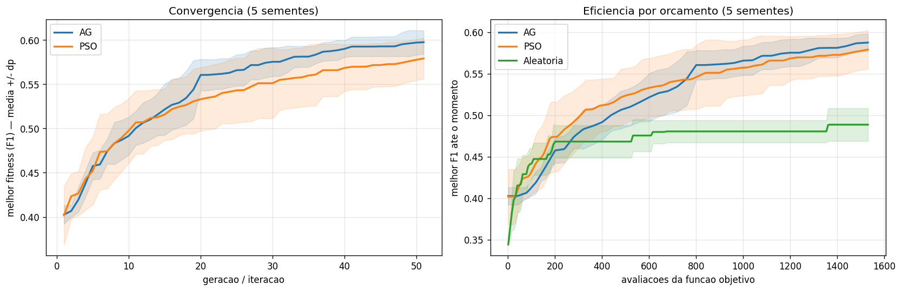
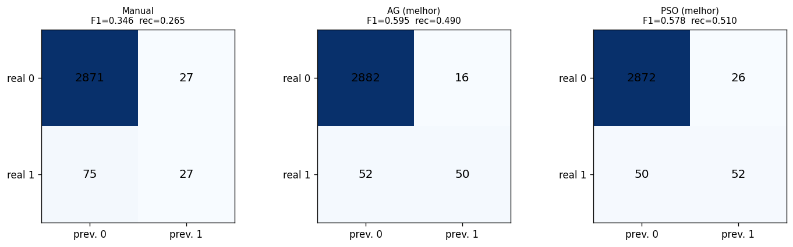
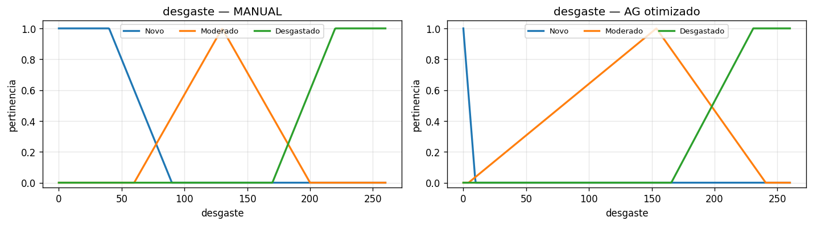
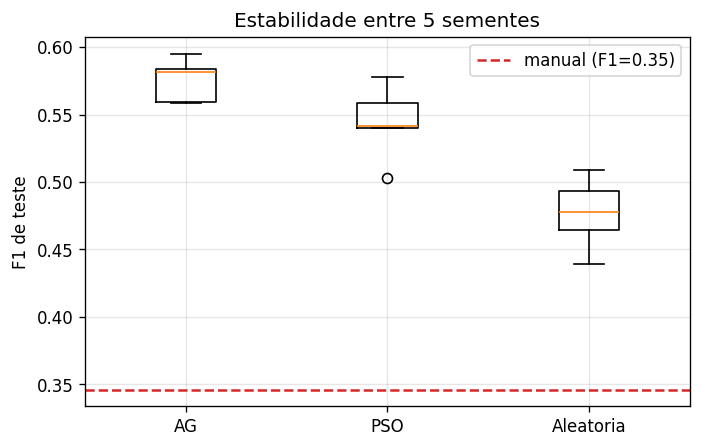

# Otimizacao Automatica de um Sistema Fuzzy por Computacao Evolutiva
## Trabalho de Pesquisa e Desenvolvimento — Parte 2 (IA Evolutiva e Computacao Bioinspirada)

**Disciplina:** Inteligencia Artificial e Computacional (0700M8) — CESUPA, 2026/01
**Abordagem:** otimizacao de hiperparametros fuzzy (integra a Parte 1) com **AG** e **PSO**
**Turma:** _(preencher)_ · **Integrantes:** _(preencher)_
**Repositorio:** _(link GitHub)_

---

## Resumo

Formulamos a **sintonia das funcoes de pertinencia** do sistema fuzzy de manutencao
preditiva (Parte 1) como um **problema de otimizacao** e o resolvemos com **Algoritmo
Genetico (AG)** e **Otimizacao por Enxame de Particulas (PSO)**, comparando contra
dois baselines: o fuzzy **manual** (especialista) e a **busca aleatoria** com o mesmo
orcamento de avaliacoes. Em 5 execucoes independentes por metodo, o AG eleva o F1 da
classe falha de **0,346 (manual)** para **0,576** (media; melhor 0,595), com aumento
expressivo de recall (0,265 -> 0,488). O PSO atinge 0,544 e a busca aleatoria 0,477,
evidenciando que o ganho vem da **busca dirigida**, e nao apenas do numero de
avaliacoes.

## 1. Problema e objetivo

O sistema fuzzy da Parte 1, sintonizado manualmente, e interpretavel mas detecta
poucas falhas (recall 0,27). Em vez de ajustar os parametros "no olho", buscamos os
melhores parametros de forma **automatica**, transformando o ajuste num problema de
otimizacao em espaco continuo de 31 dimensoes. A metaheuristica e tratada como o
algoritmo principal exigido na Parte 2; o sistema fuzzy fornece a **funcao de
aptidao**.

## 2. Formulacao da otimizacao

| Elemento | Definicao |
|---|---|
| Variaveis de decisao | 31 breakpoints ajustaveis das MFs (entradas + saida) |
| Representacao | vetor real; bounds = universo de cada variavel |
| Espaco de busca | hipercubo limitado pelos universos de discurso |
| Funcao objetivo | **F1 da classe falha** no conjunto de TREINO (maximizar) |
| Restricoes | ordenacao dos breakpoints (a<=b<=c<=d), tratada por reparo (sort) |
| Baselines | fuzzy manual (especialista) e busca aleatoria |

Os ombros das MFs presos ao limite do universo permanecem fixos, reduzindo a
dimensionalidade. O limiar que converte o risco continuo em decisao binaria e
escolhido em cada avaliacao maximizando o F1 de treino; a avaliacao final usa o
**teste** com o limiar fixado no treino (evitando vazamento).

## 3. Algoritmos

### 3.1 Algoritmo Genetico (real-coded)
Selecao por **torneio**, crossover **BLX-alpha**, mutacao **gaussiana** por gene e
**elitismo**. A populacao inicial inclui a sintonia manual + perturbacoes + individuos
aleatorios (inicializacao informada). Com elitismo, o resultado nunca piora em relacao
ao baseline. Configuracao: populacao 40, 50 geracoes (2040 avaliacoes).

### 3.2 PSO (global-best)
Atualizacao classica de Kennedy & Eberhart com inercia `w=0,72`, coeficientes
`c1=c2=1,49`, clamp de velocidade e reflexao nos limites. Configuracao: enxame 30,
50 iteracoes (1530 avaliacoes). Mesma funcao objetivo e mesma codificacao do AG,
garantindo comparacao justa.

### 3.3 Busca aleatoria
Amostra genomas uniformemente no espaco de busca com o mesmo orcamento do AG (2040
avaliacoes). Mostra quanto do ganho vem da busca dirigida.

## 4. Metodologia experimental

Por serem estocasticos, todos os metodos foram executados com **5 sementes
independentes** (1 a 5). Registramos qualidade (F1 melhor/pior/media/desvio),
**recall**, **curvas de convergencia**, **eficiencia por orcamento** de avaliacoes e
**custo computacional** (tempo, numero de avaliacoes). O dataset e dividido uma unica
vez (split estratificado 70/30, semente 42) para que todos os metodos vejam os mesmos
conjuntos.

## 5. Resultados

### 5.1 Qualidade da solucao (5 sementes)

| Metodo | F1 melhor | F1 pior | F1 media | desvio | Recall (media) | Avaliacoes | Tempo |
|---|---|---|---|---|---|---|---|
| Manual (baseline) | 0,346 | 0,346 | 0,346 | 0,000 | 0,265 | 1 | - |
| Busca aleatoria | 0,509 | 0,439 | 0,477 | 0,024 | 0,416 | 2040 | ~18 s |
| PSO | 0,578 | 0,503 | 0,544 | 0,025 | 0,475 | 1530 | ~13 s |
| **Algoritmo Genetico** | **0,595** | **0,559** | **0,576** | **0,014** | **0,488** | 2040 | ~32 s |

O AG e o melhor e o mais **estavel** (menor desvio). A ordem **AG > PSO > aleatoria >
manual** e consistente em todas as sementes.

### 5.2 Convergencia e eficiencia por orcamento

A esquerda mostra a convergencia por geracao/iteracao (media +/- desvio); ambos
convergem, com o AG terminando ligeiramente acima. A direita compara o melhor F1 por
**numero de avaliacoes**: o PSO e mais eficiente nas primeiras avaliacoes, o AG o
ultrapassa adiante, e a **busca aleatoria estagna** em ~0,48 — o ganho do AG/PSO nao
e fruto do orcamento, e sim da busca dirigida.

### 5.3 Antes x Depois (otimizacao automatica dos parametros fuzzy)

A otimizacao reduz drasticamente os falsos negativos (falhas nao detectadas). O
deslocamento das MFs e interpretavel: o termo "Novo" do desgaste foi **estreitado**,
ou seja, o otimizador aprendeu que mesmo desgaste leve ja carrega risco.

### 5.4 Estabilidade

## 6. Analise critica

- **Semelhancas/diferencas:** AG e PSO chegam a desempenho proximo; o PSO converge
  mais rapido por avaliacao no inicio, o AG explora mais e termina melhor e mais
  estavel. **Causa provavel:** o elitismo + crossover BLX do AG preservam e recombinam
  boas regioes; o PSO global-best converge cedo para o gbest.
- **Generalizacao:** ha uma folga treino->teste (ex.: AG 0,595 treino -> 0,581 teste
  na semente 1), esperada ao ajustar MFs e limiar ao treino, mas **sem overfitting
  severo**.
- **Limitacoes:** o fuzzy nao compete com classificadores dedicados em F1 absoluto; o
  valor esta na **transparencia**. A funcao objetivo e mono-objetivo (so F1); pesos de
  regra nao foram otimizados.
- **Custo computacional:** todas as execucoes terminam em segundos a dezenas de
  segundos, gracas ao motor fuzzy vetorizado (~8 ms por avaliacao sobre 7000 amostras).

## 7. Conclusao e trabalhos futuros

A computacao evolutiva otimizou automaticamente o sistema fuzzy, elevando o F1 de
~0,35 para ~0,58 e quase dobrando o recall, **preservando a interpretabilidade**.
Trabalhos futuros: otimizar tambem **pesos de regra**, usar **fitness multiobjetivo**
(F1 x interpretabilidade) e **validacao cruzada**, alem de testar Evolucao
Diferencial.

## 8. Declaracao de uso de IA

Ver `docs/declaracao_ia.md`.

## Referencias

Kennedy & Eberhart (1995); Holland (1975); Matzka (2020). Demais em `README.md`.
