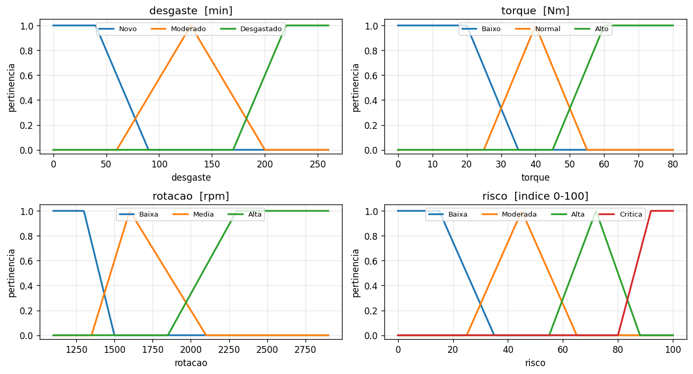
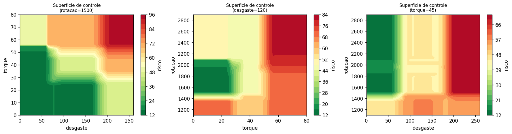
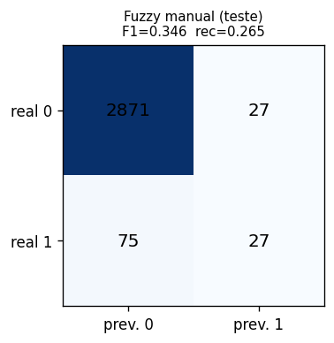

# Sistema de Controle Fuzzy
## Manutencao Preditiva Industrial — Parte 1

Inteligencia Artificial e Computacional (0700M8) — CESUPA 2026/01

**Modalidade:** Opcao B (produto) · Motor **Mamdani**

Equipe: _(preencher)_ · Turma: _(preencher)_

---

## O problema

- Decidir **quando intervir** numa maquina envolve **imprecisao** e **gradacao**.
- "Desgaste alto", "torque elevado", "rotacao baixa" nao tem fronteira nitida.
- O operador raciocina de forma **linguistica** -> logica fuzzy e adequada.
- **Nao** e exemplo de sala: ancorado em dados reais e modos de falha fisicos.

---

## Os dados — AI4I 2020 (UCI)

- 10.000 ciclos de operacao de uma maquina industrial.
- Rotulo binario de falha + modos: TWF, HDF, PWF, OSF.
- **Desbalanceado: 3,39% de falhas** -> acuracia engana; usamos **F1** e Youden.
- 3 entradas: desgaste (TWF/OSF), torque (OSF/PWF), rotacao (PWF/HDF).

---

## Variaveis e universos de discurso

| Variavel | Universo | Termos |
|---|---|---|
| Desgaste | 0-260 min | Novo / Moderado / Desgastado |
| Torque | 0-80 Nm | Baixo / Normal / Alto |
| Rotacao | 1100-2900 rpm | Baixa / Media / Alta |
| **Risco** (saida) | 0-100 | Baixa / Moderada / Alta / Critica |

Parametros ancorados nos **quantis reais** do dataset.

---

## Funcoes de pertinencia

Triangulares e trapezoidais, com sobreposicao deliberada (preserva o carater fuzzy).

---

## Base de regras (20 regras)

- Cada regra justificada por um **modo de falha**.
- Exemplos:
  - SE desgaste=Desgastado E torque=Alto -> risco **Critica** (OSF)
  - SE torque=Baixo E rotacao=Baixa -> risco **Alta** (PWF baixa potencia)
  - SE desgaste=Novo E torque=Alto E rotacao=Alta -> risco **Moderada** (conflito)

Inferencia: AND=min · implicacao=min · agregacao=max · defuzzificacao=centroide.

---

## Cenarios e superficies de controle

OSF (desgaste x torque) e PWF em "U" (torque x rotacao) confirmados.

---

## Validacao quantitativa

- F1 = 0,346 · Recall = 0,265 · Precisao = 0,500 · Youden = 0,255.
- Interpretavel, mas recall baixo -> **motiva a Parte 2**.

---

## Conclusao — Parte 1

- Sistema fuzzy coerente: problema -> variaveis -> MFs -> regras -> resultados.
- Produto demonstravel (CLI com explicacao + notebook).
- Baseline interpretavel (F1 ~ 0,35) e a **ponte** para a otimizacao evolutiva.
